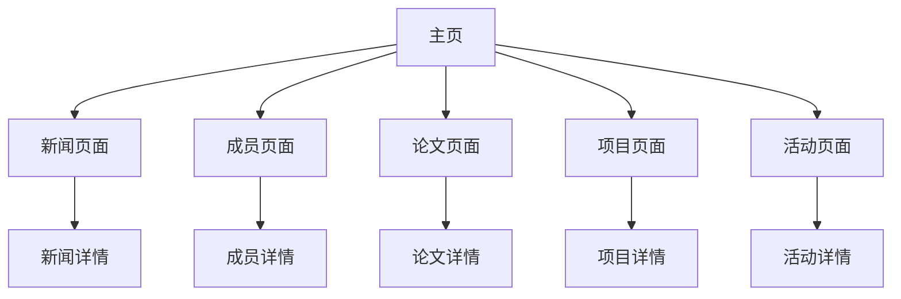

# 实验室展示网站产品需求文档

## 1. Product Overview
实验室展示网站是一个现代化的静态网站，用于展示实验室的研究成果、团队成员、最新动态等信息。
- 主要解决实验室对外展示和信息传播的需求，面向学术界、合作伙伴、学生等用户群体，通过美观的界面和便捷的内容管理提升实验室形象。
- 目标是打造一个专业、现代、易维护的学术展示平台，提升实验室在学术界的影响力和知名度。

## 2. Core Features

### 2.1 User Roles
本项目采用静态网站架构，无需用户注册登录系统。所有访问者均为匿名用户，可自由浏览所有公开内容。

### 2.2 Feature Module
我们的实验室展示网站包含以下主要页面：
1. **主页**：实验室介绍、核心亮点展示、快速导航
2. **新闻页面**：实验室动态、最新消息、重要公告
3. **成员页面**：团队成员介绍、研究方向、联系方式
4. **论文页面**：学术论文列表、研究成果展示、下载链接
5. **项目页面**：研究项目介绍、项目进展、技术细节
6. **活动页面**：学术活动、会议讲座、workshop信息

### 2.3 Page Details

| Page Name | Module Name | Feature description |
|-----------|-------------|---------------------|
| 主页 | Hero Banner | 展示实验室核心理念和视觉形象，包含动态背景效果和核心标语 |
| 主页 | 实验室简介 | 简要介绍实验室历史、研究领域、核心优势 |
| 主页 | 快速导航 | 提供到各个子页面的快速入口，采用卡片式设计 |
| 主页 | 最新动态 | 展示最近3-5条重要新闻和活动预告 |
| 新闻页面 | 新闻列表 | 按时间倒序展示所有新闻，支持分页浏览 |
| 新闻页面 | 新闻详情 | 显示新闻完整内容，支持Markdown渲染 |
| 新闻页面 | 分类筛选 | 按新闻类型（研究进展、获奖信息、活动公告等）进行筛选 |
| 成员页面 | 成员网格 | 以卡片形式展示所有成员照片、姓名、职位 |
| 成员页面 | 成员详情 | 显示成员详细信息、研究方向、联系方式、个人主页链接 |
| 成员页面 | 分组显示 | 按职位层级（教授、博士后、博士生、硕士生）分组展示 |
| 论文页面 | 论文列表 | 按年份和重要性展示学术论文，包含标题、作者、期刊信息 |
| 论文页面 | 搜索过滤 | 支持按关键词、年份、期刊类型搜索论文 |
| 论文页面 | 下载链接 | 提供PDF下载、DOI链接、引用格式等 |
| 项目页面 | 项目展示 | 以时间线或卡片形式展示研究项目 |
| 项目页面 | 项目详情 | 显示项目背景、技术路线、成果产出、参与人员 |
| 项目页面 | 技术标签 | 按技术领域和研究方向对项目进行标签分类 |
| 活动页面 | 活动日历 | 以日历形式展示即将举行的活动 |
| 活动页面 | 活动列表 | 按时间顺序展示历史和未来活动 |
| 活动页面 | 活动详情 | 显示活动时间、地点、议程、报名信息 |

## 3. Core Process

访问者浏览流程：
1. 用户访问主页，了解实验室基本信息和最新动态
2. 通过导航菜单进入感兴趣的子页面（新闻、成员、论文、项目、活动）
3. 在各子页面浏览详细内容，可通过搜索、筛选功能快速定位信息
4. 通过外部链接访问论文下载、成员个人主页等资源

内容管理流程：
1. 管理员通过编辑Markdown文件更新网站内容
2. 将更新推送到GitHub仓库
3. GitHub Actions自动构建并部署到GitHub Pages
4. 网站内容实时更新

## 4. User Interface Design

### 4.1 Design Style
- **主色调**：深蓝色 (#1e3a8a) 和科技蓝 (#3b82f6)，辅助色为浅灰 (#f8fafc) 和白色 (#ffffff)
- **按钮样式**：现代扁平化设计，带有微妙阴影和悬停动效
- **字体**：英文使用 Inter 字体，中文使用思源黑体，标题字号 24-32px，正文 16px
- **布局风格**：响应式网格布局，采用卡片式设计，顶部固定导航栏
- **图标风格**：使用 Heroicons 或 Feather Icons，线性风格，保持一致性
- **动效**：页面切换使用淡入淡出效果，卡片悬停有轻微上浮动画

### 4.2 Page Design Overview

| Page Name | Module Name | UI Elements |
|-----------|-------------|-------------|
| 主页 | Hero Banner | 全屏背景图片或视频，渐变遮罩，大标题文字，CTA按钮，粒子动效 |
| 主页 | 导航栏 | 固定顶部，半透明背景，Logo左对齐，菜单项右对齐，移动端汉堡菜单 |
| 主页 | 内容区域 | 三栏网格布局，卡片阴影效果，图标+标题+描述的组合 |
| 新闻页面 | 新闻卡片 | 缩略图+标题+摘要+日期，悬停放大效果，标签颜色区分类型 |
| 成员页面 | 成员卡片 | 圆形头像，姓名职位，社交媒体图标，悬停显示更多信息 |
| 论文页面 | 论文条目 | 期刊图标，论文标题，作者列表，发表信息，下载按钮 |
| 项目页面 | 项目卡片 | 项目封面图，技术标签，进度条，团队成员头像 |
| 活动页面 | 活动时间线 | 垂直时间线设计，日期节点，活动卡片，状态标识 |

### 4.3 Responsiveness
网站采用移动优先的响应式设计，支持桌面端、平板和手机端访问。在移动端优化触摸交互，增大点击区域，简化导航结构。